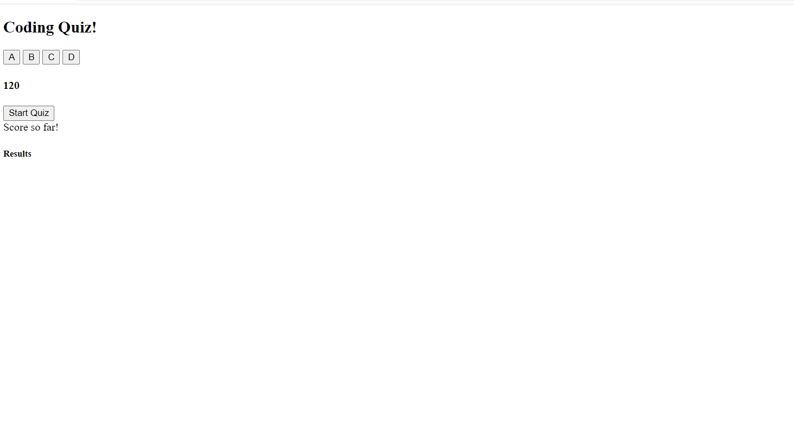
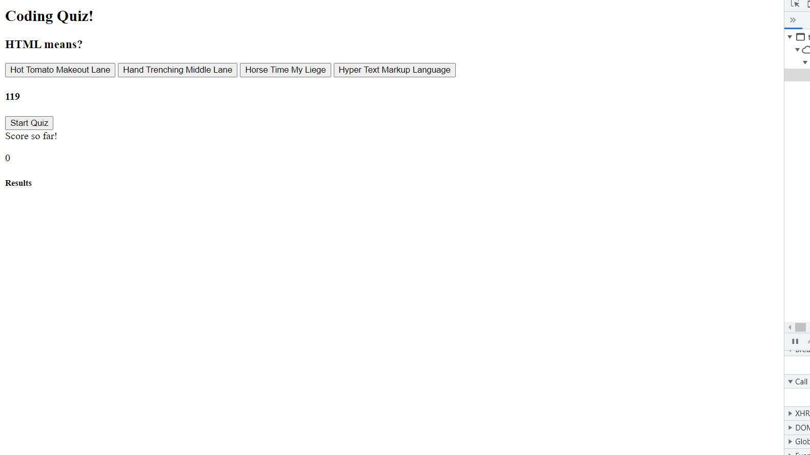
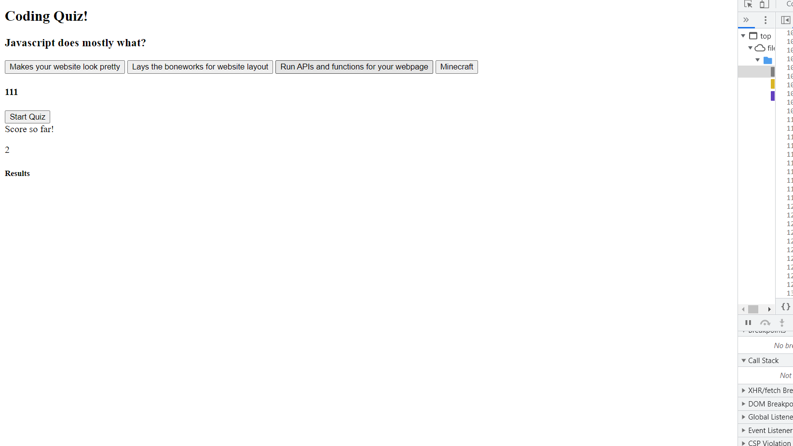
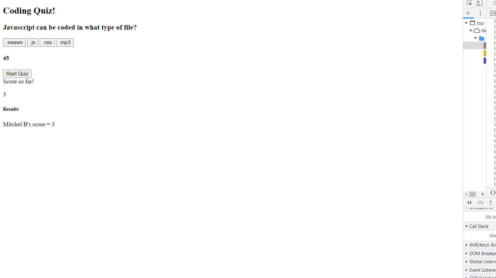

# CodingQuizRepo

<h1>The Coding Quiz is here...</h1>

This was extremely difficult for me to program, and it took several days of troubleshooting to get everything to work. There's no CSS, which I didn't have the liberty of adding before the due date, but besides the CSS, everything else is there. A simple code quiz with a timer and functions to record score and name! Enjoy!

<a href="https://average-android.github.io/CodingQuizRepo/">Link to the Coding Quiz</a>